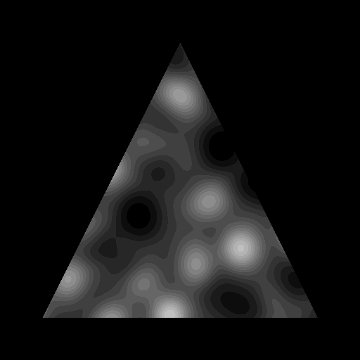

# perlin-gif
Tool for perlin gif creation.

## Installation
```
sudo apt-get install gifsicle

# Create virtual env
python3 -m venv env
source env/bin/activate

# Upgrade pip
pip install -U pip

git clone https://github.com/LoicGoulefert/perlin-gif.git

cd perlin-gif
pip install -r requirements.txt
```

## Usage

```
python main.py
```

You can configure various parameters for the gif creation. Here's an example (see main.py):

```
gif_config = {
    "noise_dimension": 4,  # Can be either 3 or 4
    "size": size,  # Size of the output gif
    "fps": 30,
    "frames": 90,
    "scale": (0.005, 0.005),  # Scale of the perlin noise
    "octaves": 1,
    "radius": 0.3,  # Increase to 'speed up' the gif
    "compression": False,
    "output_file": "out.gif",
    "random_seed": True,
    "pipeline": Pipeline()  # Post processing operations
}
```


## Output example

- No postprocessing


- Border, quantize, brightness correction


- Border, quantize, triangle mask



- Particles in a perlin flowfield


